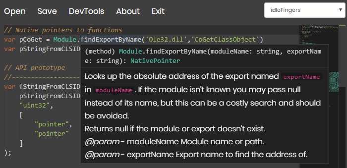
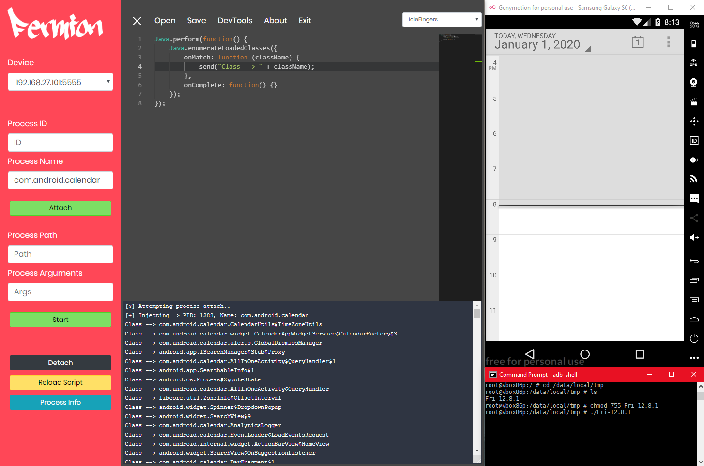
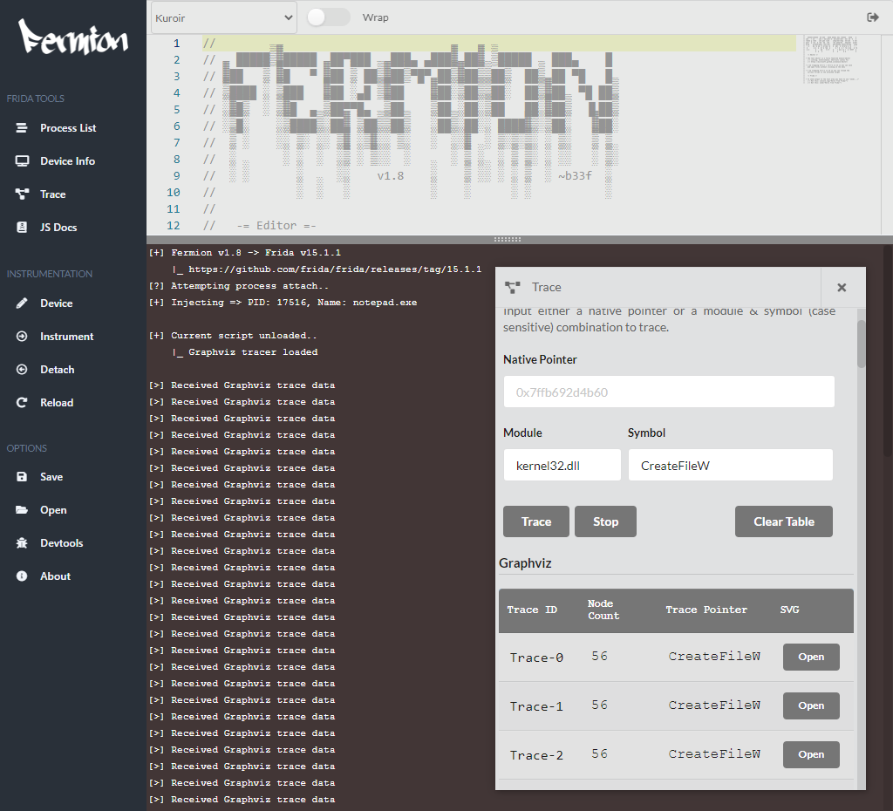
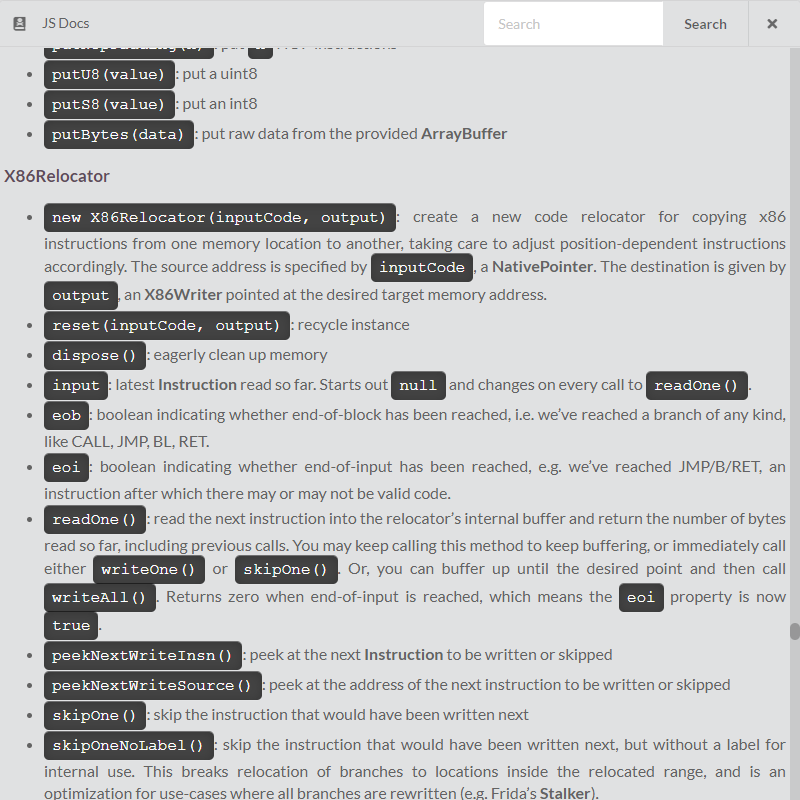

     

# Fermion

Fermion is an electron application that wraps [frida-node](https://github.com/frida/frida-node) and [monaco-editor](https://microsoft.github.io/monaco-editor/). It offers a fully integrated environment to prototype, test and refine Frida scripts through a single UI. With the integration of Monaco come all the features you would expect from Visual Studio Code: Linting, IntelliSense, keybindings, etc. In addition, Fermion has a TypeScript language definition for the Frida API so it is easy to write Frida scripts.

`What's in a name`: A fermion can be an elementary particle, such as the electron, or it can be a composite particle, such as the proton. Fermions include all quarks and leptons, as well as all composite particles made of an odd number of these, such as all baryons and many atoms and nuclei.

## How to get Fermion?

### Run Fermion from source

Download the repository and navigate to the `Fermion` folder in the terminal. Once there, set the following environment variables.

```
# Windows
set npm_config_runtime=electron
set npm_config_target=21.0.0

# Linux / OSX
export npm_config_runtime=electron
export npm_config_target=21.0.0
```

Afterwards install the packages required to run Fermion with:

```
npm install
```

Once complete, you can run Fermion by issuing:

```
npm start
```

### Compile a release package

Complete the steps above and then issue the following command from the terminal:

```
# Windows
electron-packager . --icon .\src\images\fermion-ico.ico

# Linux
electron-packager . --icon ./src/images/fermion-ico.png

# OSX
electron-packager . --icon ./src/images/fermion-ico.icns
```

### Releases

You can get the latest pre-built Fermion for x64 Windows and Linux from [releases](https://github.com/FuzzySecurity/Fermion/releases).

## FAQ notes

### Windows

  * **Q**: I need to inject a SYSTEM level process, how can I do that?
    * **A**: You used to be able to utilize tools like psexec to run Fermion as SYSTEM however since Electron v8 this causes Fermion to freeze. What you really need is for Fermion to run as Administrator and have SeDebugPrivilege privileges. As a workaround you can launch PowerShell as Administrator and use that to launch Fermion.

### Linux

  * **Q**: I can't attach to a running process?
    * **A**: System restrictions may prevent you from attaching, normally you will see a message in `Fermion` to tell you what the problem is and how you can solve it. However, generally, you can run `Fermion` or the `Frida Server` as `root` or alternatively run the following command `sudo sysctl kernel.yama.ptrace_scope=0`.

### General

  * **Q**: I want to build my own version of Fermion against a new version of Frida/Electron. How can I find out which `prebuild`’s exist currently?
    * **A**: You should have a look [here](https://github.com/frida/frida/blob/main/.github/workflows/ci.yml), you can check the default build version in `ELECTRON_TARGETS_DEFAULT` and `ELECTRON_TARGETS_FREEBSD` respectively.

  * **Q**: I want to review/change/update the type definitions used in the Monaco editor, how can I do that?
    * **A**: This is now handled as part of the build process so your language definitions should always be up-to-date. If you want to edit the app language definitions manually, you can find them here `node_modules/@types/frida-gum/index.d.ts`.

  * **Q**: Why you no stable `trace` man (╯°□°)╯︵ ┻━┻
    * **A**: Call tracing is resource intensive. In most cases it will work fine but if you are tracing a `hot pointer` and/or the trace is generating graphs with thousands of nodes then you will likely find that the `trace window` will lag out while it is receiving data. Also, as with any kind of tracing, it can cause process instability / crashing / freezing.

## About

You can see an example of `Fermion` at work below, in this case instrumenting `kernel32!ReadFile`.


Fermion has auto-complete, linting and Frida API symbol support.



Fermion can connect to a Frida server to debug remote applications using the `device` context menu. In many cases such as with `USB` debugging or when attaching to mobile applications through emulators like `genymotion` Fermion will automatically pick up the server as available. However, it is also possible to specify a remote server using an `IP` and `Port` combination.



Fermion has built-in support for thread `CALL tracing`.



This may not do exactly what you expect it to. When you define either a `pointer` or `module`/`Symbol` combination the tracer will `attach` to that location and any time a `thread` executes at that place it will start tracing all `CALL` instructions that thread performs till it returns. This means that different executions can generate different graphs, it also means that you may not see everything a function is doing (e.g. if, inside the function, a different thread gets spawned).


Fermion converts these traces into a `Graphviz SVG` format using `dot` which you can then explore. This is a feature which I find useful on occasion when performing exploratory work (What does a function do? How complex is that execution?). That being said, this is a `prototype` feature which I built on top of Fermion and probably needs some more loving to be more production ready.

Fermion also has built-in documentation for Frida's `JavaScript API`. Like everyone else I don't always remember how everything works and having the docs in the app obviates the need to have a browser window open.



## Notes

### ChangeLog

For more details on version specific changes consult the [changelog](https://github.com/FuzzySecurity/Fermion/blob/master/CHANGELOG.txt).

### Call to action

If you integrate Fermion into your work-flow and find it useful I encourage you to make pull requests, submit bug reports and ask for features to improve the application. I'm not exactly a Node developer so I am sure people will find ways optimize and rework some of the components.

### Roadmap

* ~~Implement a more complete device manager interface.~~
* ~~UI re-design.~~
* Gauge the appetite for more native tools built on top of Fermion and add these.
* Extend the device manager to take advantage of the new features integrated into `Frida v15.0+`.

### Special thanks

I just want to give a few special thanks!

* A huge thanks to [Ole André V. Ravnås](https://twitter.com/oleavr) for all his work on Frida and having a lot of patience answering my pedestrian questions about Frida, NodeJS and Monaco!
* A shout-out also to [mattahan](https://www.deviantart.com/mattahan). I'm using a Buuf icon for the Windows package of Fermion. I'm sure we have all used some of his icons on NIX over the years.
* Thanks to @MiscMisty, @lez0sec, @berkayyildi for contributing time/code to Fermion!
